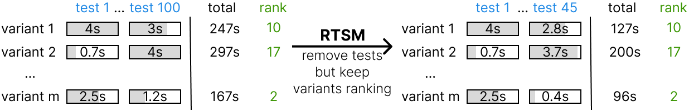

# Ranked Test Suite Minimisation (RTSM)



This is the repository for the RTSM tool associated with the following paper: [Efficiently Ranking Software Variants with Minimal Benchmarks](https://arxiv.org/abs/2509.06716).

The ``main`` branch is the classic tool that anyone can use whereas the ``experiments`` branch contain everything to reproduce the experiments and analysis of the paper.

The goal is to minimise a test set while keeping the discriminating power of the test set.
Here a test is an instance on which performances can be measured for a variant.
A variant is an instance of a program, it can be different algorithms or different versions of the same algorithms with different parameters  for example.
Our tool takes as input a performance matrix of these variants on the set of tests.
Then our tool produces the subset of tests you need to keep the discriminative power of your tests.

In other words, it can be used to minimise benchmarks, to study variability of software, etc.
A lot of options are configurable.
Of course, this is not magic, this assumes that the next variants that are going to be tested are somehow in the same distribution as the variants used in order to minimise.


Benchmarks are available at <https://github.com/Theomat/benchmarks-rtsm>.

<!-- toc -->

- [Installation](#installation)
- [Usage](#usage)
  - [Check your solution](#check-your-solution)
  - [Multiprocessing](#multiprocessing)
  - [Start from an existing solution](#start-from-an-existing-solution)
  - [Multi performance metrics](#multi-performance-metrics)
  - [Genetic Algorithm](#genetic-algorithm)
- [Input Format](https://github.com/Theomat/benchmarks-rtsm)
<!-- - [Citing](#citing) -->

<!-- tocstop -->

## Installation

Install ``rtsm`` with your favorite tool by cloning this repository.

## Usage

The best way is to use the help flags but this section describes typical use cases.
To have good cases or example scenarios, we recommend cloning the [benchmarks](https://github.com/Theomat/benchmarks-rtsm).

Here is how you can start by simply running the following command:

```bash
python -m rtsm.crunch ./unique-benchmarks/humaneval_plus_pass1.csv
```

Note that you can also use ``rtsm`` directly but the ``crunch`` tries to optimise the solution and find best parameters to get the best solution as fast as possible, we recommend using the ``crunch`` version unless you know what you are doing.

### Check your solution

This example being easy it should quickly.
So we produced a file ``rtsm_solutions.json`` which contains one or more solution to our problem.
Now we would like to check our solution, we can use:

```bash
python -m rtsm.check_solution ./unique-benchmarks/humaneval_plus_pass1.csv rtsm_solutions.json
```

THis should provide you with quite a lot of information about the solution that you have.
Now this instance is quite easy and has few tests that can actually be removed.

### Multiprocessing

**Warning**: Multiprocessing kills reproducibility of results, since sub-task ordering is not guaranteed to be the same across runs and new subtasks depend on previous results then changing the execution order changes final results.

The ``SAT20-MAIN.csv`` contains 400 tests so we will use multiple CPUs:

```bash
python -m rtsm.crunch ./benchmarks/SAT20-MAIN_cost.csv  -p 8
```

The first progress will come quite fats but on harder instances we may have to wait longer.
So let's say that after a while, we want to stop but we'd like not to lose our progress.
In fact, we can just kill the process and while exiting the best solutions found so far will be saved automatically.
Great!

### Start from an existing solution

Now, I would like to start from a solution that I found to see if I can find a better one:

```bash
python -m rtsm.crunch ./benchmarks/SAT20-MAIN_cost.csv  -p 8 --start my_solution.json
```

### Export your prediction model

Let us say now that we have a solution and we would like to export the prediction model to use it elsewhere then we can do:

```bash
python -m rtsm.export ./benchmarks/SAT20-MAIN_cost.csv my_solution.json  -o dst.json
```

### Multi performance metrics

What if you wanted to minimise the test set for two performance metrics? Well if both performance metrics are in your input file, that will be done automatically, you have nothing to do!

For multiple performance metrics, the accuracy parameter is such that the worse accuracy among all performance metrics is greater than this accuracy threshold.

### Genetic Algorithm

There is a GA solver, which is available only if [PyGAD](https://pygad.readthedocs.io/en/latest/index.html) is installed. However, it is not recommended as it is **dramatically slower** and offers **dramatically worse** performances than other methods. In other words, we did not manage to make it work despite our attempts. If you find a set of parameters that make genetic algorithms work, please reach out or contribute.
